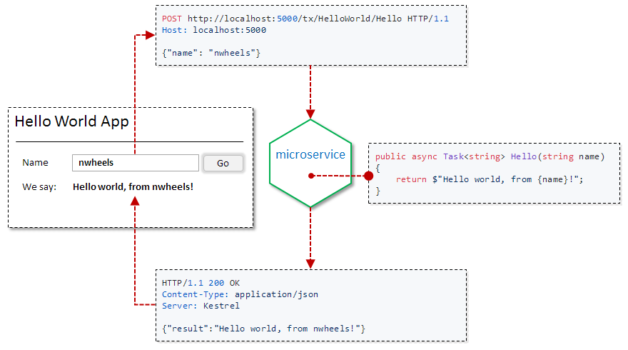

# Demo

NWheels is already capable of bootstrapping a microservice which has business logic and exposes a simple web app, as shown in the figure below. 



NWheels-based implementation is below 50 lines of C# code, all layers included. 

_Currently, the demo uses mockup assets for the single-page web app. Planned are pluggable SPA themes and code generation of assets on top of the theme. Implementation code listed below will not be affected by the change._

## Source code explained

#### Program.cs - microservice entry point

It is super simple to bootstrap a microservice. Most of the time, you're all set with the defaults. For advanced scenarios, extensible API of `MicroserviceHostBuilder` lets you tailor technology stack to your requirements. 

```csharp
public static int Main(string[] args)
{
    var microservice = new MicroserviceHostBuilder("hello")
        .AutoDiscoverComponents()
        .UseDefaultWebStack(listenPortNumber: 5000)
        .Build();

    return microservice.Run(args);
}
```

#### HelloWorldTx.cs - business logic

Business logic for this demo is trivial. It is captured in a _transaction script component_ class. 

```csharp
[TransactionScriptComponent]
[SecurityCheck.AllowAnonymous]
public class HelloWorldTx
{
    [TransactionScriptMethod]
    public async Task<string> Hello(string name)
    {
        return $"Hello world, from {name}!";
    }
}
```

There's more under the hood, though. For instance, default web stack includes RESTful API endpoint, where transaction scripts are one type of supported resources. The endpoint transparently allows invocation of resources through HTTP and other protocols, subject to authorization requirements.

Here, `Hello` method can be invoked through HTTP request:

```HTTP
POST http://localhost:5000/tx/HelloWorld/Hello HTTP/1.1
User-Agent: Fiddler
Host: localhost:5000
Content-Length: 17

{"name": "NWheels"}
```
The endpoint will reply as follows:

```HTTP
HTTP/1.1 200 OK
Date: Wed, 05 Jul 2017 05:40:55 GMT
Content-Type: application/json
Server: Kestrel
Content-Length: 39

{"result":"Hello world, from NWheels!"}
```

#### Authorization

It worths noting that `[SecurityCheck.AllowAnonymous]` attribute here is required to allow access without prior authentication and validation of claims. 

Authorization infrastructure of NWheels transparently enforces access control rules to resources, components, and data throughout all execution paths. The rules can either be declared with attributes (like in this example), or configured through access control API. Depending on application requirements, configuration through the API can either be hard-coded, or based on data in a persistent storage (e.g. DB).

#### HelloWorldApp.cs - web app

The next piece is user interface. NWheels dramatically boosts development and maintenance productivity by supporting declarative UI. The UI is declared through high-level conceptual models, abstracted from concrete technology stacks. 

The models focus on UI structure, navigation, and binding to business data and capabilities. Lower-level front-end/UX and client/server communication details are not concerned on this level. 

Auhtorization rules that control access to bound data and capabilities are automatically reflected in the user interface.

```csharp
[WebAppComponent]
public class HelloWorldApp : WebApp<Empty.SessionState>
{
    [DefaultPage]
    public class HomePage : WebPage<Empty.ViewModel>
    {
        [ViewModelContract]
        public class HelloWorldViewModel 
        {
            [FieldContract.Required]
            public string Name;
            [FieldContract.Semantics.Output, FieldContract.Presentation.Label("WeSay")]
            public string Message;
        }

        [ContentElement] 
        [TransactionWizard.Configure(SubmitCommandLabel = "Go")]
        public TransactionWizard<HelloWorldViewModel> Transaction { get; set; }

        protected override void ImplementController()
        {
            Transaction.OnSubmit.Invoke<HelloWorldTx>(
                tx => tx.Hello(Transaction.Model.Name)
            ).Then(
                result => Script.Assign(Transaction.Model.Message, result)
            );
        }
    }
}
```
Stunning high-usability user interfaces are created separately by UX experts in corresponding interaction platforms. The experts build UI technology stacks, and provide code generators that implement UI models on top of those stacks. User interfaces are allowed to have numerous themes and variations. 

Sometimes though, all this is not enough. Certain UI areas demand unique touch. In such cases, parts of generated platform-specific code and assets can be manually adjusted or replaced. 

Besides the web, we aim to support mobile native apps, desktop apps, SmartTV, IVR, and IoT platforms. 

## Running the demo 

### System requirements

- Running on your machine:
  - Linux, Windows, or macOS machine 
  - .NET Core SDK 1.1 or later ([download here](https://www.microsoft.com/net/download/core))

- Running in Docker (Linux container):
  ```bash
  $ docker run --name nwheels-demo -p 5000:5000 -it microsoft/dotnet:1.1-sdk /bin/bash
  ```

### Get sources and build

  ```bash
  $ git clone https://github.com/felix-b/NWheels.git nwheels
  $ cd nwheels/Source/
  $ dotnet restore
  $ dotnet build
  ```

### Run microservice

  ```bash
  $ dotnet NWheels.Samples.FirstHappyPath.HelloService/bin/Debug/netcoreapp1.1/hello.dll
  ```
  
### Open web application

- If running on your machine: 
  - Browse to [http://localhost:5000](http://localhost:5000)
- If running in docker container: 
  - Print container IP address:
    ```bash
    $ docker inspect -f '{{range .NetworkSettings.Networks}}{{.IPAddress}}{{end}}' nwheels-demo
    ```
  - Browse to http://_container_ip_address_:5000
 
