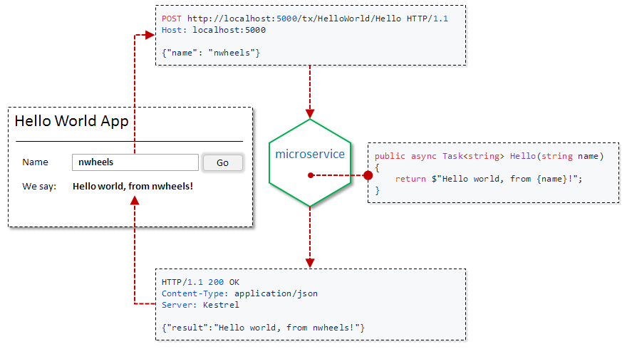

Linux|Windows|Coverage
-----|-------|--------
TBD|[](https://ci.appveyor.com/project/felix-b/nwheels-bk3vs/branch/master)|[](https://coveralls.io/github/felix-b/NWheels?branch=master)

Welcome to NWheels
=======


Based on our experience, commonality in the needs of enterprise application projects is significantly higher than variability. 

We take this as an opportunity to let software vendors build and operate way larger and flexible software, with way smaller teams, within way shorter timeframes. 

<p align="center" style="text-align:center">
<br/>

</p>

# How it works

## TL;DR

- recurring and common requirements are covered out of the box
- architecture is based on microservices, implemented by hexagonal ("ports-and-adapters") design pattern
- technology stacks are abstracted with concise C# programming models; the models are translated into technology-specific implementations (manual overrides allowed). Example:
  - UI model in C#, translated into an npm project of a single-page web app based on either React, Angular, or Polymer - depending on picked technology - saving thousands lines of code to write and maintain.
- expertise in common problem domains is shared through reusable domain modules
- everything is extensible and pluggable

_ATTENTION: we are redoing from scratch after successful proof of concept. Features listed here may not yet exist, or be unstable_. 

## Responsibility segregation 

NWheels:|Application developers:
---|---
Implements industrial-strength architectures with full-stack coverage of typical requirements and DevOps/ALM aspects. Subjects covered include information security, business intelligence, testability, multitenancy, scalability, health monitoring with production profiling, fault tolerance, customizability, internationalization, continuous delivery, and more.|Get an automated customizable DevOps workflow, and a production-ready software system right off, which only misses unique features of the application being developed.   
Provides application developers with full-stack concise programming models, abstracted from concrete technology stacks. Dramatically reduces size of application codebase. Allows writing code clean from underlying technology details. Enforces common conventions throughout the codebase. Allows projects to work both fast and right, starting on day one.|Implement application features in C# on top of NWheels programming models, including UI, business logic, data access, communication endpoints, and more.
Supplies building blocks for common problem domains, based on field-proven patterns and designs. Such domains include e-commerce, CRM, booking, marketing, accounting, and many more. Flexible vertical and horizontal composability of NWheels domain models enables easy extension and adaptation of building blocks to application requirements.|Whenever possible, reuse domain building blocks; extend and adapt them to application requirements. Save on effort and mistakes. Avoid reinvention of the wheel.
Supplies pluggable adapters to concrete technology stacks, including databases, provisioning/scalability platforms, messaging middleware, UI technologies, DevOps infrastructure, and many more. Adapters generate implementations of application programming models per underlying technologies. Adapters also include and configure required 3rd-party services in automated deployments (e.g., Redis, MongoDB).|Pick ready technology stacks to plug in, according to application requirements. Save on technology learning curve and technology expert services. Easily afford changes in technology choices.

# Demo

NWheels is already capable of bootstrapping a microservice which has business logic and exposes a simple web app, as shown in the figure below. 



_Currently, the demo uses mockup assets for the single-page web app. Planned are pluggable SPA themes and code generation of assets on top of the theme. Implementation code listed below will not be affected by the change._

## Code

NWheels-based implementation is about 50 lines of code in C#, all layers included. More details and explanations [can be found here](Docs/Wiki/demo.md).

#### Program.cs - microservice entry point
```csharp
public static int Main(string[] args)                          
{
    var microservice = new MicroserviceHostBuilder("hello")  
        .AutoDiscoverComponents()
        .UseDefaultWebStack(listenPortNumber: 5000)
        .Build(); 

    return microservice.Run(args);
}
```
#### HelloWorldTx.cs - business logic
```csharp
[TransactionScriptComponent]
[SecurityCheck.AllowAnonymous]
public class HelloWorldTx
{
    [TransactionScriptMethod]
    public async Task<string> Hello(string name)
    {
        return $"Hello world, from {name}!";
    }
}
```
#### HelloWorldApp.cs - web app
```csharp
[WebAppComponent]
public class HelloWorldApp : WebApp<Empty.SessionState>
{
    [DefaultPage]
    public class HomePage : WebPage<Empty.ViewModel>
    {
        [ViewModelContract]
        public class HelloWorldViewModel 
        {
            [FieldContract.Required]
            public string Name;
            [FieldContract.Semantics.Output, FieldContract.Presentation.Label("WeSay")]
            public string Message;
        }

        [ContentElement] 
        [TransactionWizard.Configure(SubmitCommandLabel = "Go")]
        public TransactionWizard<HelloWorldViewModel> Transaction { get; set; }

        protected override void ImplementController()
        {
            Transaction.OnSubmit.Invoke<HelloWorldTx>(
                tx => tx.Hello(Transaction.Model.Name)
            ).Then(
                result => Script.Assign(Transaction.Model.Message, result)
            );
        }
    }
}
```
## Running the demo 

### System requirements

- Running on your machine:
  - Linux, Windows, or macOS machine 
  - .NET Core SDK 1.1 or later ([download here](https://www.microsoft.com/net/download/core))

- Running in Docker (Linux container):
  ```bash
  $ docker run --name nwheels-demo -p 5000:5000 -it microsoft/dotnet:1.1-sdk /bin/bash
  ```

### Get sources and build

  ```bash
  $ git clone https://github.com/felix-b/NWheels.git nwheels
  $ cd nwheels/Source/
  $ dotnet restore
  $ dotnet build
  ```

### Run microservice

  ```bash
  $ dotnet NWheels.Samples.FirstHappyPath.HelloService/bin/Debug/netcoreapp1.1/hello.dll
  ```
  
### Open web application

- If running on your machine: 
  - Browse to [http://localhost:5000](http://localhost:5000)
- If running in docker container: 
  - Print container IP address:
    ```bash
    $ docker inspect -f '{{range .NetworkSettings.Networks}}{{.IPAddress}}{{end}}' nwheels-demo
    ```
  - Browse to http://_container_ip_address_:5000

# Feature Highlights

- **Programming languages**: applications are developed in C#, and primarily target cross-plafrorm .NET Core or .NET Standard. Targeting Windows-only .NET Framework is also supported. 

- **Kinds of applications**: 
  - Multi-tier systems consisting of UI apps, microservices, and databases
  - API backends and high-throughput low-latency data processing middleware, optionally based on in-memory data/actor grids
  - B2B integration solutions 
  - Fat standalone or peer-to-peer UI apps that include business logic
  - Any combination of the above

- **Runtime environments**
  - Servers will run on Linux, Windows, any macOS. Any compatible IaaS/CaaS cloud, hybrid, and on-premises deployments will be supported. 
  - UI will run as native mobile apps, web single-page apps, desktop apps on Linux/Windows/macOS; UI on top of IVR, SmartTV, and IoT platforms will be supported.

- **Scalability and high availability** 
  - Scalable, fault-tolerant, containerized, microservice- and lambda-based architectures. 
  - Elastic scalability and high availability with zero-downtime deployments; cross-zone and cross-cloud-vendor DR environments will be supported for mission-critical systems.
  
- **Extensibility**: NWheels is extensible all the way; we welcome contributions by the community
  - **Technology stack adapters**: adapter modules can be contributed to support wide range of technology stacks
  - **Domain building blocks**: expertise in problem domains can be shared through contribution of domain building block modules
  - **Programming models** (for the most advanced): new programming models can be developed to introduce new development concepts and paradigms.
  - **Modularity all the way**: both NWheels and NWheels-based applications are customizable and extensible through the mechanism of pluggable modules and features. For SaaS and off-the-shelf software products, this means out-of-the-box support for modular licensing and customer-specific solutions.    

# More Info

More info on NWheels can be found in resources listed below: 

- Documentation (WIP) - [TODO: provide link to wiki]()
- Architecture (WIP) - [TODO: provide link to wiki]()
- Philosophy behind NWheels (WIP) - [TODO: provide link to wiki]()
- Examples in Q&A format (WIP) - [TODO: provide link to Stack Overflow]()
- Working procedures and conventions - see [Contribution Guidelines](CONTRIBUTING.md)

# Getting Involved

Excited? We'd like having you onboard!

Community is a vital part of the NWheels project. Here we are building a welcoming and friendly ecosystem for expertise sharing and contribution.

## Where to start

1. Please make yourself familiar with our [Code of Conduct](CODE_OF_CONDUCT.md).
1. Run the demo (if you haven't already done that)
1. Carefully read our [Contribution Guidelines](CONTRIBUTING.md).
   - Follow instructions in the [First-timers section](CONTRIBUTING.md#first-timers-read-here)
1. Please feel free to communicate your thoughts and reach out for help.

# Current Status

Starting from February 2017, we are developing our second take at NWheels. 

### Current milestone: 01 - First Happy Path

- [Milestone](https://github.com/felix-b/NWheels/milestone/2)
- [Scrum board](https://github.com/felix-b/NWheels/projects/1)
- [Issues](https://github.com/felix-b/NWheels/issues?utf8=%E2%9C%93&q=is%3Aissue%20is%3Aopen%20milestone%3A%2201%20First%20happy%20path%22%20)

# History

The first take at NWheels was named _Milestone Afra_. It is now in use by two proprietary real-world applications. Further development was abandoned for high technical debt, few architectural mistakes, and in favor of targeting cross-platform .NET Core.

### Concept proven

Applications built on top of NWheels milestone Afra shown us that the core concept is correct and robust. With that, we learned a lot of lessons, and faced few mistakes in architecture and implementation.

### Timeline

Year|Summary
-|-
2013|Started development of [Hapil](https://github.com/felix-b/Hapil) library for code generation, which is an essential part of NWheels concept.
2014|Hapil library gained enough features. Started development of NWheels milestone Afra. Implemented server bootstrapping and metadata-based composition of domain objects. Added support for data persistence through Entity Framework.
2015|Development of NWheels milestone Afra continued. Added support for Mongo DB. Started development of model-based UI, and web UI stack based on a Bootstrap theme, AngularJS, and ASP.NET Web API.
2016|NWheels milestone Afra reached enough maturity to support full-stack development. Two proprietary real-world applications developed on top of NWheels milestone Afra: one released to production, one is in the beta stage. These applications proved that the concept of NWheels works, but taught us a few lessons.
2017|Further development of NWheels milestone Afra abandoned; started development of second take at NWheels, completely from scratch.

