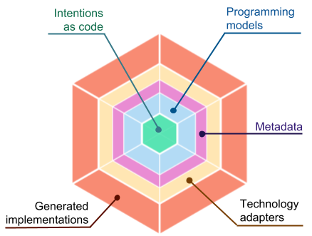

## Welcome to NWheels

**CURRENT STATUS**: the `master` branch is **Gen2**, in incubation phase. Field-tested **Gen1** can be found in  [gen-1 branch](https://github.com/nwheels-io/NWheels/tree/gen-1). **Gen1** proved to have some conceptual flaws, which **Gen2** comes to fix. Most important, **Gen2** is a set of policies on top of transpiler mechanism by [MetaPrograms project](https://github.com/nwheels-io/MetaPrograms).


# How it works



- **Intents as code**: express your application with minimal amount of code clean from technology details
- **Programming models DSLs**: APIs on top of which intents are coded; every layer and aspect has a dedicated DSL backed by programming model. Programming models digest DSL intents into metadata for technology adapters.
- **Technology adapters**: pluggable code generators, which take metadata as input from programming models, and generate code for concrete platforms, products, and frameworks
- **Generated implementations**: production-ready human-maintainable codebases, including CI/CD pipeline

Maintain your code in DSLs in the long run, because DSLs are great cost saver and velocity booster. Alternatively, use NWheels as a scaffolding or prototyping tool. 

Eject at any moment: drop the DSLs and start maintaining the generated codebase. There is no reverse engineering: only eject when you absolutely have to.

# Getting started

## Installation

### Prerequisites

- A machine running Linux, macOS, or Windows
- .NET Core SDK 2.1 or higher

### Install CLI

```
$ dotnet tool install -g nwheels --version 2.0.0-alpha1
```
## Demo

```
$ git clone https://github.com/nwheels-io/NWheels.git nwheels
$ cd nwheels/demos/01-todo-list
$ dotnet run
```
## Creating your own application

```
$ dotnet new nwheels MyFirstApp
$ cd MyFirstApp
$ dotnet run
```

# DSLs and technology adapters

Below is the current list of supported DSLs, together with supported technology adapters.

Technology adapters that are links point to their source repos. Those which aren't links are planned, but the work hasn't yet started. The list of adapters will eventually be much larger.

DSL|Supported adapters|Planned next
---|---|---
UI | [web/React+Redux]() | web/Angular ; mobile/ReactNative ; desktop/Electron
REST API | [dotnet/ASP.NET Core]() | node/express
Domain | [dotnet]() | node
Actors | | dotnet/Akka.Net ; jvm/Akka
OxM | [dotnet/MongoDB]() | dotnet/EFCore ; node/mongoose ; node/sequelize
DB | [MongoDB]() | MySQL ; CosmosDB ; CloudStorage | [Elastic]() | TICK ; 
MQ | | Kafka
Distributed Cache | | Redis
Authorization | [dotnet]() | node
Testability | [dotnet/NUnit]() | node/jest
Extensibility | | dotnet ; web ; node
Customization | | dotnet ; web ; node
I18n | | dotnet ; web ; node
Monitoring | [Elastic]() | TICK ; LogzIO ; Azure DevOps ; Google StackDriver
BI | | Zoho Analytics ; Splunk
Deployment | [Docker+Kubernetes]() |
Microservices | [dotnet]() | node
CI/CD | [AppVeyor]() | CodeFresh
