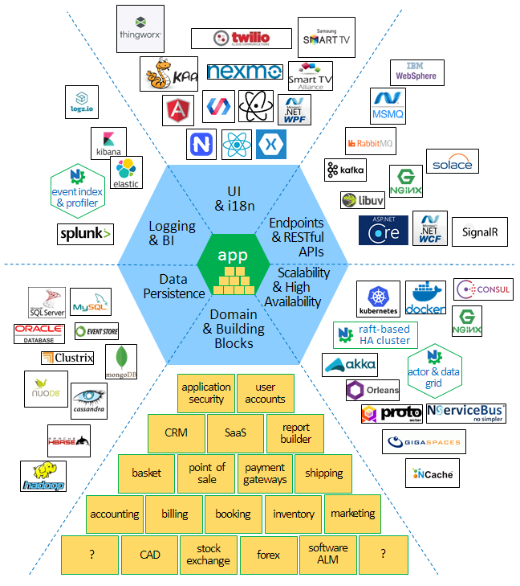

Linux|Windows|Coverage
-----|-------|--------
TBD|[](https://ci.appveyor.com/project/felix-b/nwheels-bk3vs/branch/master)|[](https://coveralls.io/github/felix-b/NWheels?branch=master)

Welcome to NWheels
=======


Based on our experience, commonality in the needs of enterprise application projects is significantly higher than variability. 

We take this as an opportunity to let software vendors build and operate way larger and flexible software, with way smaller teams, within way shorter timeframes. 

<p align="center" style="text-align:center">
<br/>

</p>

## How it works

_DISCLAIMER: we are redoing from scratch after successful proof of concept. Features listed here may not yet exist, or be unstable_. 

NWheels:|Software vendors:
---|---
Implements industrial-strength architectures that provide full-stack coverage of typical requirements and DevOps/ALM aspects, such as information security, business intelligence, scalability, fault tolerance, and many more. Supplies application developers with concise programming models, abstracted from technology stacks. Delivers production-ready software system right off, which only misses unique features of your enterprise application.|Implement application requirements in C# on top of NWheels programming models, including UI, microservices, business logic, communication endpoints, and more. The code is short and clean; it expresses application requirements without mixing in details of underlying technology.
Supplies flexible building blocks for common problem domains, which have field-proven design patterns. Such domains include: e-commerce, CRM, PRM, booking, point of sale, marketing, inventory management, shipping, accounting, shipment, transportation, and many more.|Whenever possible, reuse domain building blocks, extending and adjusting them according to application requirements. Save on development effort and design mistakes. Avoid reinvention of the wheel.
Supplies pluggable adapters to concrete technology stacks, including databases, messaging middleware, UI platforms, DevOps infrastructure, and more. Adapters generate implementations of application programming models on top of corresponding technologies, languages, and frameworks. Adapters are also responsible for including and configuring necessary 3rd-party services and tools (e.g., MongoDB or Elastic) in automated deployments.|Pick ready technology stacks to plug in, according to application requirements. Save on technology learning curve and beginner's mistakes, or technology expert services. Easily afford changes in technology choices.

## Feature Q & A

Question|Answer
---|---
What programming languages are supported?|Applications are developed in C#, and primarily target cross-plafrorm .NET Core or .NET Standard. Targeting Windows-only .NET Framework is also supported. 
What kind of applications can be built?|Multi-tier systems consisting of UI apps, microservices, and databases; web/RESTful API backends, data processing middleware, B2B communications, actor/data grids; standalone UI apps that embed business logic and/or allow peer-to-peer communication; any combination of the above
Where the applications will run?|Servers will run on Linux, Windows, or macOS. Any compatible IaaS/CaaS cloud, hybrid, and on-premises deployments will be supported. UI will run as native mobile apps, web single-page apps, desktop apps on Linux/Windows/macOS; user interaction will also be supported on top of IVR, SmartTV, and IoT platforms.
Scalability and high availability?|NWheels implements scalable, fault-tolerant, containerized, microservice- and lambda-based architectures. This enables elastic scalability and high availability with zero-downtime deployments. Health monitoring, self-healing environments, and support of cross-zone and cross-cloud-vendor DR environments, enable creation of mission-critical systems. 

# Demo

NWheels is already capable of bootstrapping a microservice with partially implemented web stack.

Imagine a very simple application:
- A single page web app, which lets user enter her name, and submit it with a button. 
- A microservice, which handles the submission. The microservice exposes RESTful API invoked by the web app button. 
- Business logic (_transaction script_), which receives user's name, and responds with a greeting text. The greeting text is then displayed in the web app.

NWheels-based implementation is below 50 lines of C# code, all layers included. 

_Note that web client implementation is a mockup prototype -- the real web client stack has yet to be developed._

## Running the demo 

### System requirements

- Running on your machine:
  - Linux, Windows, or macOS machine 
  - .NET Core SDK 1.1 or later ([download here](https://www.microsoft.com/net/download/core))

- Running in Docker (Linux container):
  ```bash
  $ docker run --name nwheels-demo -p 5000:5000 -it microsoft/dotnet:1.1-sdk /bin/bash
  ```

### Get sources and build

  ```bash
  $ git clone https://github.com/felix-b/NWheels.git nwheels
  $ cd nwheels/Source/
  $ dotnet restore
  $ dotnet build
  ```

### Run microservice

  ```bash
  $ dotnet NWheels.Samples.FirstHappyPath.HelloService/bin/Debug/netcoreapp1.1/hello.dll
  ```
  
### Open web application

- If running on your machine: 
  - Browse to [http://localhost:5000](http://localhost:5000)
- If running in docker container: 
  - Print container IP address:
    ```bash
    $ docker inspect -f '{{range .NetworkSettings.Networks}}{{.IPAddress}}{{end}}' nwheels-demo
    ```
  - Browse to http://_container_ip_address_:5000
 
## Source code explained

#### Program.cs - microservice entry point

It is super simple to bootstrap a microservice. Most of the time, you're all set with the defaults. For advanced scenarios, extensible API of `MicroserviceHostBuilder` lets you tailor technology stack to your requirements. 

```csharp
public static int Main(string[] args)
{
    var microservice = new MicroserviceHostBuilder("hello")
        .AutoDiscoverComponents()
        .UseDefaultWebStack(listenPortNumber: 5000)
        .Build();

    return microservice.Run(args);
}
```

#### HelloWorldTx.cs - business logic

Business logic for this demo is trivial. It is captured in a _transaction script component_ class. 

```csharp
[TransactionScriptComponent]
[SecurityCheck.AllowAnonymous]
public class HelloWorldTx
{
    [TransactionScriptMethod]
    public async Task<string> Hello(string name)
    {
        return $"Hello world, from {name}!";
    }
}
```

There's more under the hood, though. For instance, default web stack includes RESTful API endpoint, where transaction scripts are one type of supported resources. The endpoint transparently allows invocation of resources through HTTP and other protocols, subject to authorization requirements.

Here, `Hello` method can be invoked through HTTP request:

```HTTP
POST http://localhost:5000/tx/HelloWorld/Hello HTTP/1.1
User-Agent: Fiddler
Host: localhost:5000
Content-Length: 17

{"name": "NWheels"}
```
The endpoint will reply as follows:

```HTTP
HTTP/1.1 200 OK
Date: Wed, 05 Jul 2017 05:40:55 GMT
Content-Type: application/json
Server: Kestrel
Content-Length: 39

{"result":"Hello world, from NWheels!"}
```

#### Authorization

It worths noting that `[SecurityCheck.AllowAnonymous]` attribute here is required to allow access without prior authentication and validation of claims. 

Authorization infrastructure of NWheels transparently enforces access control rules to resources, components, and data throughout all execution paths. The rules can either be declared with attributes (like in this example), or configured through access control API. Depending on application requirements, configuration through the API can either be hard-coded, or based on data in a persistent storage (e.g. DB).

#### HelloWorldApp.cs - web app

The next piece is user interface. NWheels dramatically boosts development and maintenance productivity by supporting declarative UI. The UI is declared through high-level conceptual models, abstracted from concrete technology stacks. 

The models focus on UI structure, navigation, and binding to business data and capabilities. Lower-level front-end/UX and client/server communication details are not concerned on this level. 

Auhtorization rules that control access to bound data and capabilities are automatically reflected in the user interface.

```csharp
[WebAppComponent]
public class HelloWorldApp : WebApp<Empty.SessionState>
{
    [DefaultPage]
    public class HomePage : WebPage<Empty.ViewModel>
    {
        [ViewModelContract]
        public class HelloWorldViewModel 
        {
            [FieldContract.Required]
            public string Name;
            [FieldContract.Semantics.Output, FieldContract.Presentation.Label("WeSay")]
            public string Message;
        }

        [ContentElement] 
        [TransactionWizard.Configure(SubmitCommandLabel = "Go")]
        public TransactionWizard<HelloWorldViewModel> Transaction { get; set; }

        protected override void ImplementController()
        {
            Transaction.OnSubmit.Invoke<HelloWorldTx>(
                tx => tx.Hello(Transaction.Model.Name)
            ).Then(
                result => Script.Assign(Transaction.Model.Message, result)
            );
        }
    }
}
```
Stunning high-usability user interfaces are created separately by UX experts in corresponding interaction platforms. The experts build UI technology stacks, and provide code generators that implement UI models on top of those stacks. User interfaces are allowed to have numerous themes and variations. 

Sometimes though, all this is not enough. Certain UI areas demand unique touch. In such cases, parts of generated platform-specific code and assets can be manually adjusted or replaced. 

Besides the web, we aim to support mobile native apps, desktop apps, SmartTV, IVR, and IoT platforms. 

# More Info

More info on NWheels can be found in resources listed below: 

- Documentation (WIP) - [TODO: provide link to wiki]()
- Architecture (WIP) - [TODO: provide link to wiki]()
- Philosophy behind NWheels (WIP) - [TODO: provide link to wiki]()
- Examples in Q&A format (WIP) - [TODO: provide link to Stack Overflow]()
- Working procedures and conventions - see [Contribution Guidelines](CONTRIBUTING.md)

# Getting Involved

Excited? We'd like having you onboard!

Community is a vital part of the NWheels project. Here we are building a welcoming and friendly ecosystem for contributors.

Please make yourself familiar with our [Code of Conduct](CODE_OF_CONDUCT.md).

## Where to start

1. Run the demo
1. Carefully read our [Contribution Guidelines](CONTRIBUTING.md).
1. Join our team on Slack:
   - Send an email with subject `Join NWheels team` to [team@nwheels.io](mailto:nwheels.io). You will receive back an email from Slack with join link and instructions.
1. Read our [Roadmap](docs/Wiki/roadmap.md). Look through **Contribution Areas** section and choose areas you're interested in contributing to.
1. Start from resolving some issues, preferably those labeled  `beginners-friendly`. 
1. Please feel free to communicate your thoughts and reach out for help.

# Current Status

Starting from February 2017, we are developing our second take at NWheels. 

### Current milestone: 01 - First Happy Path

- [Milestone](https://github.com/felix-b/NWheels/milestone/2)
- [Scrum board](https://github.com/felix-b/NWheels/projects/1)
- [Issues](https://github.com/felix-b/NWheels/issues?utf8=%E2%9C%93&q=is%3Aissue%20is%3Aopen%20milestone%3A%2201%20First%20happy%20path%22%20)

# History

The first take at NWheels was named _Milestone Afra_. It is now in use by two proprietary real-world applications. Further development was abandoned for high technical debt, few architectural mistakes, and in favor of targeting cross-platform .NET Core.

### Concept proven

Applications built on top of NWheels milestone Afra shown us that the core concept is correct and robust. With that, we learned a lot of lessons, and faced few mistakes in architecture and implementation.

### Timeline

Year|Summary
-|-
2013|Started development of [Hapil](https://github.com/felix-b/Hapil) library for code generation, which is an essential part of NWheels concept.
2014|Hapil library gained enough features. Started development of NWheels milestone Afra. Implemented server bootstrapping and metadata-based composition of domain objects. Added support for data persistence through Entity Framework.
2015|Development of NWheels milestone Afra continued. Added support for Mongo DB. Started development of model-based UI, and web UI stack based on a Bootstrap theme, AngularJS, and ASP.NET Web API.
2016|NWheels milestone Afra reached enough maturity to support full-stack development. Two proprietary real-world applications developed on top of NWheels milestone Afra: one released to production, one is in the beta stage. These applications proved that the concept of NWheels works, but taught us a few lessons.
2017|Further development of NWheels milestone Afra abandoned; started development of second take at NWheels, completely from scratch.

