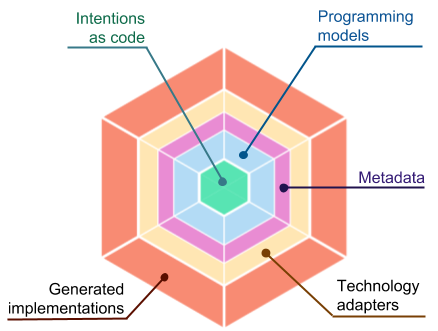

## Welcome to NWheels

A **code-first full-stack** application framework, which aims to **save 80%** of development efforts.

[](https://ci.appveyor.com/project/felix-b/metaprograms)
[](https://ci.appveyor.com/project/felix-b/metaprograms)
[](https://codecov.io/gh/nwheels-io/MetaPrograms)
[](http://www.nuget.org/packages/MetaPrograms/)

# How it works



- **Intentions as code**: express your application with minimal amount of code clean from technology details
- **Programming models**: APIs on top of which _intentions_ are coded; on the outer side, the _intentions_ are digested into _metadata_ for _technology adapters_.
- **Technology adapters**: pluggable code generators, which take _metadata_ as input from _programming models_, and generate code  


- Everything is a service: UI apps, micro-frontends, and backend (micro)services 
- A service is expressed with a minimalistic amount of _intentions as code_ on top of _programming model APIs_.
  - Programming models represent common areas of requirements, such as authorization, UI, data access, deployment, etc.
  -   

You code intentions, and NWheels generates production-ready full-stack application per your technology choices.
- You can maintain intentions as code for the long run, or eject at any time, taking ownership of generated projects.

### Why 
- Reduce costs and timeframes
- Stop re-inventing the wheel 
- Work both fast and right, starting on day one
- Share and reuse adaptable solutions in business domains 


## Features


- Intentions-as-code
- Technology abstraction
- Testability of your application
- Extensibility of your application
- Extensibility of the framework
- Ready adaptable solutions to common requirements, including:
  - authentication and authorization
  - user account management
  - SaaS and customizability
  - monitoring, alerting, and BI
  - high availability
  - ...and more
- Production readiness and continuous delivery pipeline
- Adaptable intentions-as-code packages for business domains (such as e-commerce, CRM, marketing, fintech, ...)
- Ability to eject (take ownership of generated implementations)

## Why


## Demo

The demo implements a full-stack version of typical "Todo List" application. The source code can be found at https://github.com/nwheels-io/NWheels.Demos/TodoList.

> Note that technology choices made in the demo are just an example. In your applications, you can choose products and frameworks for which _technology adapter packages_ exist. 

Here is what you get for as little as 100 lines of _intentions as code_: 

- Single-page web app (React + Redux), including:
  - Responsive design (customizable stock templates / your own design)
  - Progressive behavior, including server-side rendering
  - Production build (Create React App: WebPack, Babel, ...)  
- Native Android & iOS apps (React Native)
- Stateless microservice (ASP.NET Core), which provides:
  - RESTful API (HTTP)
  - Input validation
  - Data access to MongoDB database 
  - Optimistic concurrency
  - Logging and telemetry (Elastic)
- Production-ready backend environment (Docker & Kubernetes), including:
  - Deployment anywhere on Kubernetes cluster (the cluster must exist) 
  - Free SSL certificate (Let's Encrypt)    
  - Reverse proxy (NGINX) with SSL termination and request throttling
  - Monitoring and alerting (Elastic X-Pack), including health/liveness checks 
  - High availability (DB redundancy, container orchestration) 
- Business intelligence (Elastic X-Pack)
- Continuous delivery pipeline (Git + Jenkins), which include:
  - git repository (hosted anywhere)
  - tests: unit, API, end-to-end, stress/load (based on intentions-as-code specs)
  - code coverage metrics
  - DB migrations
  - deployment to mobile stores
  - deployment to backend environments 

### Running demo on your machine

Requirements:

- Linux, macOS, or Windows
- 16 GB RAM
- .NET Core SDK 2.1 or higher
- Docker 18.06 or higher

Follow these steps:

1. Install NWheels CLI:
   ```
   $ dotnet tool install --global NWheels.Cli
   ```

1. Clone and build demo project:
   ``` 
   $ git clone https://github.com/nwheels-io/NWheels.Demos
   $ cd NWheels.Demos/TodoList
   $ dotnet build -c Release
   ```

1. Generate implementation on top of a concrete technology stack: 
   ```
   $ nwheels implement . --stack local-demo
   ```

1. Run the backend: 
   ```
   $ docker-compose -f deploy/docker-compost.yml up
   ```

1. Navigate to the web app:
   ```
   http://localhost/
   ```

### Running demo on cloud


## Getting Started


## Architecture


> It is called **intentions-as-code**: an approach, which lets a software system be coded (in whole or in part) on the conceptual level,  

## Contributing
